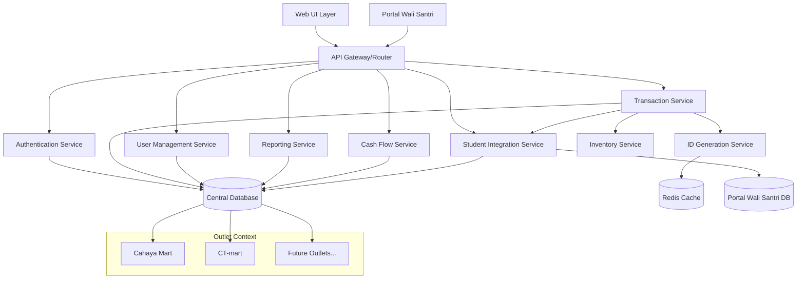

# Design Document

## Overview

The Multi-Outlet POS System extends the existing Point of Sale (PoS) Kasir system to support multiple outlet management with the addition of CT-mart as separate from the existing Cahaya Mart. The system implements comprehensive user management with roles and scopes, unique transaction and invoice ID generation per outlet, advanced transaction processing architecture, and integrated reporting with cash flow modules.

### Key Design Principles

- **Outlet Isolation**: Each outlet operates with separate data contexts while maintaining centralized management
- **Scalable ID Generation**: Outlet-specific sequence numbering prevents conflicts and enables traceability
- **Role-Based Access Control**: Fine-grained permissions system with outlet-specific scopes
- **Data Consistency**: Robust synchronization mechanisms with offline capability
- **Audit Trail**: Complete transaction tracing and activity logging

## Architecture

### High-Level Architecture



### Service Layer Architecture

The system follows a microservices-inspired modular architecture within a monolithic deployment:

- **API Gateway**: Routes requests and enforces outlet context
- **Authentication Service**: Handles login, permissions, and role validation
- **Transaction Service**: Core POS transaction processing
- **ID Generation Service**: Manages unique ID sequences per outlet
- **User Management Service**: Role and scope administration
- **Inventory Service**: Outlet-specific stock management
- **Reporting Service**: Cross-outlet analytics and reports
- **Cash Flow Service**: Financial tracking and reconciliation
- **Student Integration Service**: Portal Wali Santri integration and student transaction tracking

## Components and Interfaces

### Database Schema

#### Core Tables

**outlets**
```sql
CREATE TABLE outlets (
    id BIGINT PRIMARY KEY AUTO_INCREMENT,
    code VARCHAR(10) UNIQUE NOT NULL,
    name VARCHAR(255) NOT NULL,
    address TEXT,
    phone VARCHAR(50),
    email VARCHAR(255),
    tax_rate DECIMAL(5,4) DEFAULT 0.0000,
    status ENUM('active', 'inactive', 'maintenance') DEFAULT 'active',
    settings JSON,
    created_at TIMESTAMP DEFAULT CURRENT_TIMESTAMP,
    updated_at TIMESTAMP DEFAULT CURRENT_TIMESTAMP ON UPDATE CURRENT_TIMESTAMP,
    
    INDEX idx_code (code),
    INDEX idx_status (status)
);
```

**users**
```sql
CREATE TABLE users (
    id BIGINT PRIMARY KEY AUTO_INCREMENT,
    username VARCHAR(100) UNIQUE NOT NULL,
    email VARCHAR(255) UNIQUE NOT NULL,
    password_hash VARCHAR(255) NOT NULL,
    full_name VARCHAR(255) NOT NULL,
    phone VARCHAR(50),
    status ENUM('active', 'inactive', 'suspended') DEFAULT 'active',
    last_login_at TIMESTAMP NULL,
    created_at TIMESTAMP DEFAULT CURRENT_TIMESTAMP,
    updated_at TIMESTAMP DEFAULT CURRENT_TIMESTAMP ON UPDATE CURRENT_TIMESTAMP,
    
    INDEX idx_username (username),
    INDEX idx_email (email),
    INDEX idx_status (status)
);
```

**roles**
```sql
CREATE TABLE roles (
    id BIGINT PRIMARY KEY AUTO_INCREMENT,
    name VARCHAR(100) UNIQUE NOT NULL,
    description TEXT,
    permissions JSON NOT NULL,
    is_system_role BOOLEAN DEFAULT FALSE,
    created_at TIMESTAMP DEFAULT CURRENT_TIMESTAMP,
    updated_at TIMESTAMP DEFAULT CURRENT_TIMESTAMP ON UPDATE CURRENT_TIMESTAMP,
    
    INDEX idx_name (name)
);
```

**user_outlet_assignments**
```sql
CREATE TABLE user_outlet_assignments (
    id BIGINT PRIMARY KEY AUTO_INCREMENT,
    user_id BIGINT NOT NULL,
    outlet_id BIGINT NOT NULL,
    role_id BIGINT NOT NULL,
    assigned_at TIMESTAMP DEFAULT CURRENT_TIMESTAMP,
    assigned_by BIGINT NOT NULL,
    is_active BOOLEAN DEFAULT TRUE,
    
    FOREIGN KEY (user_id) REFERENCES users(id) ON DELETE CASCADE,
    FOREIGN KEY (outlet_id) REFERENCES outlets(id) ON DELETE CASCADE,
    FOREIGN KEY (role_id) REFERENCES roles(id) ON DELETE RESTRICT,
    FOREIGN KEY (assigned_by) REFERENCES users(id) ON DELETE RESTRICT,
    
    UNIQUE KEY unique_user_outlet_role (user_id, outlet_id, role_id),
    INDEX idx_user_outlet (user_id, outlet_id),
    INDEX idx_outlet_active (outlet_id, is_active)
);
```

#### Transaction Management

**id_sequences**
```sql
CREATE TABLE id_sequences (
    id BIGINT PRIMARY KEY AUTO_INCREMENT,
    outlet_id BIGINT NOT NULL,
    sequence_type ENUM('transaction', 'invoice') NOT NULL,
    current_value BIGINT NOT NULL DEFAULT 0,
    date_context DATE NOT NULL,
    last_updated TIMESTAMP DEFAULT CURRENT_TIMESTAMP ON UPDATE CURRENT_TIMESTAMP,
    
    FOREIGN KEY (outlet_id) REFERENCES outlets(id) ON DELETE CASCADE,
    UNIQUE KEY unique_outlet_type_date (outlet_id, sequence_type, date_context),
    INDEX idx_outlet_type (outlet_id, sequence_type)
);
```

**transactions**
```sql
CREATE TABLE transactions (
    id BIGINT PRIMARY KEY AUTO_INCREMENT,
    transaction_id VARCHAR(100) UNIQUE NOT NULL,
    outlet_id BIGINT NOT NULL,
    cashier_id BIGINT NOT NULL,
    customer_id BIGINT NULL,
    total_amount DECIMAL(15,4) NOT NULL,
    tax_amount DECIMAL(15,4) DEFAULT 0.0000,
    discount_amount DECIMAL(15,4) DEFAULT 0.0000,
    final_amount DECIMAL(15,4) NOT NULL,
    payment_method ENUM('cash', 'card', 'transfer', 'mixed') NOT NULL,
    status ENUM('pending', 'completed', 'cancelled', 'refunded') DEFAULT 'pending',
    notes TEXT,
    processed_at TIMESTAMP DEFAULT CURRENT_TIMESTAMP,
    created_at TIMESTAMP DEFAULT CURRENT_TIMESTAMP,
    updated_at TIMESTAMP DEFAULT CURRENT_TIMESTAMP ON UPDATE CURRENT_TIMESTAMP,
    
    FOREIGN KEY (outlet_id) REFERENCES outlets(id) ON DELETE RESTRICT,
    FOREIGN KEY (cashier_id) REFERENCES users(id) ON DELETE RESTRICT,
    
    INDEX idx_transaction_id (transaction_id),
    INDEX idx_outlet_date (outlet_id, processed_at),
    INDEX idx_cashier_date (cashier_id, processed_at),
    INDEX idx_status (status)
);
```

**invoices**
```sql
CREATE TABLE invoices (
    id BIGINT PRIMARY KEY AUTO_INCREMENT,
    invoice_id VARCHAR(100) UNIQUE NOT NULL,
    transaction_id BIGINT NOT NULL,
    outlet_id BIGINT NOT NULL,
    invoice_number VARCHAR(50) NOT NULL,
    issued_at TIMESTAMP DEFAULT CURRENT_TIMESTAMP,
    due_date DATE NULL,
    status ENUM('draft', 'issued', 'paid', 'cancelled') DEFAULT 'draft',
    invoice_data JSON NOT NULL,
    created_at TIMESTAMP DEFAULT CURRENT_TIMESTAMP,
    updated_at TIMESTAMP DEFAULT CURRENT_TIMESTAMP ON UPDATE CURRENT_TIMESTAMP,
    
    FOREIGN KEY (transaction_id) REFERENCES transactions(id) ON DELETE CASCADE,
    FOREIGN KEY (outlet_id) REFERENCES outlets(id) ON DELETE RESTRICT,
    
    INDEX idx_invoice_id (invoice_id),
    INDEX idx_transaction (transaction_id),
    INDEX idx_outlet_issued (outlet_id, issued_at),
    INDEX idx_status (status)
);
```

#### Inventory Management

**products**
```sql
CREATE TABLE products (
    id BIGINT PRIMARY KEY AUTO_INCREMENT,
    sku VARCHAR(100) UNIQUE NOT NULL,
    name VARCHAR(255) NOT NULL,
    description TEXT,
    category_id BIGINT NULL,
    base_price DECIMAL(15,4) NOT NULL,
    cost_price DECIMAL(15,4) NOT NULL,
    barcode VARCHAR(255),
    unit VARCHAR(50) DEFAULT 'pcs',
    is_active BOOLEAN DEFAULT TRUE,
    created_at TIMESTAMP DEFAULT CURRENT_TIMESTAMP,
    updated_at TIMESTAMP DEFAULT CURRENT_TIMESTAMP ON UPDATE CURRENT_TIMESTAMP,
    
    INDEX idx_sku (sku),
    INDEX idx_barcode (barcode),
    INDEX idx_category (category_id),
    INDEX idx_active (is_active)
);
```

**outlet_products**
```sql
CREATE TABLE outlet_products (
    id BIGINT PRIMARY KEY AUTO_INCREMENT,
    outlet_id BIGINT NOT NULL,
    product_id BIGINT NOT NULL,
    outlet_price DECIMAL(15,4) NULL,
    stock_quantity DECIMAL(15,4) NOT NULL DEFAULT 0,
    min_stock_level DECIMAL(15,4) DEFAULT 0,
    max_stock_level DECIMAL(15,4) DEFAULT NULL,
    is_available BOOLEAN DEFAULT TRUE,
    last_restocked TIMESTAMP NULL,
    created_at TIMESTAMP DEFAULT CURRENT_TIMESTAMP,
    updated_at TIMESTAMP DEFAULT CURRENT_TIMESTAMP ON UPDATE CURRENT_TIMESTAMP,
    
    FOREIGN KEY (outlet_id) REFERENCES outlets(id) ON DELETE CASCADE,
    FOREIGN KEY (product_id) REFERENCES products(id) ON DELETE CASCADE,
    
    UNIQUE KEY unique_outlet_product (outlet_id, product_id),
    INDEX idx_outlet_available (outlet_id, is_available),
    INDEX idx_low_stock (outlet_id, stock_quantity, min_stock_level)
);
```

#### Cash Flow Management

**cash_flow_categories**
```sql
CREATE TABLE cash_flow_categories (
    id BIGINT PRIMARY KEY AUTO_INCREMENT,
    name VARCHAR(255) NOT NULL,
    type ENUM('inflow', 'outflow') NOT NULL,
    description TEXT,
    is_system_category BOOLEAN DEFAULT FALSE,
    created_at TIMESTAMP DEFAULT CURRENT_TIMESTAMP,
    
    INDEX idx_type (type),
    INDEX idx_system (is_system_category)
);
```

**cash_flows**
```sql
CREATE TABLE cash_flows (
    id BIGINT PRIMARY KEY AUTO_INCREMENT,
    outlet_id BIGINT NOT NULL,
    category_id BIGINT NOT NULL,
    transaction_id BIGINT NULL,
    amount DECIMAL(15,4) NOT NULL,
    type ENUM('inflow', 'outflow') NOT NULL,
    description TEXT,
    reference_number VARCHAR(100),
    recorded_by BIGINT NOT NULL,
    recorded_at TIMESTAMP DEFAULT CURRENT_TIMESTAMP,
    created_at TIMESTAMP DEFAULT CURRENT_TIMESTAMP,
    
    FOREIGN KEY (outlet_id) REFERENCES outlets(id) ON DELETE RESTRICT,
    FOREIGN KEY (category_id) REFERENCES cash_flow_categories(id) ON DELETE RESTRICT,
    FOREIGN KEY (transaction_id) REFERENCES transactions(id) ON DELETE SET NULL,
    FOREIGN KEY (recorded_by) REFERENCES users(id) ON DELETE RESTRICT,
    
    INDEX idx_outlet_date (outlet_id, recorded_at),
    INDEX idx_category_type (category_id, type),
    INDEX idx_transaction (transaction_id)
);
```

#### Student Integration Management

**students**
```sql
CREATE TABLE students (
    id BIGINT PRIMARY KEY AUTO_INCREMENT,
    student_id VARCHAR(50) UNIQUE NOT NULL,
    nis VARCHAR(20) UNIQUE NOT NULL,
    full_name VARCHAR(255) NOT NULL,
    class VARCHAR(100),
    parent_phone VARCHAR(50),
    parent_email VARCHAR(255),
    is_active BOOLEAN DEFAULT TRUE,
    created_at TIMESTAMP DEFAULT CURRENT_TIMESTAMP,
    updated_at TIMESTAMP DEFAULT CURRENT_TIMESTAMP ON UPDATE CURRENT_TIMESTAMP,
    
    INDEX idx_student_id (student_id),
    INDEX idx_nis (nis),
    INDEX idx_parent_phone (parent_phone),
    INDEX idx_active (is_active)
);
```

**student_transactions**
```sql
CREATE TABLE student_transactions (
    id BIGINT PRIMARY KEY AUTO_INCREMENT,
    transaction_id BIGINT NOT NULL,
    student_id BIGINT NOT NULL,
    outlet_id BIGINT NOT NULL,
    items_summary JSON NOT NULL,
    total_amount DECIMAL(15,4) NOT NULL,
    transaction_date TIMESTAMP NOT NULL,
    notification_sent BOOLEAN DEFAULT FALSE,
    created_at TIMESTAMP DEFAULT CURRENT_TIMESTAMP,
    
    FOREIGN KEY (transaction_id) REFERENCES transactions(id) ON DELETE CASCADE,
    FOREIGN KEY (student_id) REFERENCES students(id) ON DELETE CASCADE,
    FOREIGN KEY (outlet_id) REFERENCES outlets(id) ON DELETE RESTRICT,
    
    INDEX idx_student_date (student_id, transaction_date),
    INDEX idx_outlet_date (outlet_id, transaction_date),
    INDEX idx_transaction (transaction_id),
    INDEX idx_notification (notification_sent)
);
```

### ID Generation System

#### ID Format Specifications

**Transaction ID Format**: `[OUTLET_CODE]-TRX-[SEQUENCE]-[YYYYMMDD]`
- Example: `CHY-TRX-000001-20241215`
- Example: `CTM-TRX-000001-20241215`

**Invoice ID Format**: `[OUTLET_CODE]-INV-[SEQUENCE]-[YYYYMMDD]`
- Example: `CHY-INV-000001-20241215`
- Example: `CTM-INV-000001-20241215`

#### ID Generation Service Interface

```php
interface IdGeneratorInterface
{
    public function generateTransactionId(int $outletId): string;
    public function generateInvoiceId(int $outletId): string;
    public function getNextSequence(int $outletId, string $type, string $date): int;
    public function resetDailySequences(): void;
}

class OutletIdGenerator implements IdGeneratorInterface
{
    private $redis;
    private $database;
    
    public function generateTransactionId(int $outletId): string
    {
        $outlet = $this->getOutlet($outletId);
        $date = date('Ymd');
        $sequence = $this->getNextSequence($outletId, 'transaction', $date);
        
        return sprintf('%s-TRX-%06d-%s', $outlet->code, $sequence, $date);
    }
    
    public function generateInvoiceId(int $outletId): string
    {
        $outlet = $this->getOutlet($outletId);
        $date = date('Ymd');
        $sequence = $this->getNextSequence($outletId, 'invoice', $date);
        
        return sprintf('%s-INV-%06d-%s', $outlet->code, $sequence, $date);
    }
    
    public function getNextSequence(int $outletId, string $type, string $date): int
    {
        $cacheKey = "seq:{$outletId}:{$type}:{$date}";
        
        // Try Redis first for performance
        $sequence = $this->redis->incr($cacheKey);
        if ($sequence === 1) {
            $this->redis->expire($cacheKey, 86400); // 24 hours
        }
        
        // Synchronize with database
        $this->updateDatabaseSequence($outletId, $type, $date, $sequence);
        
        return $sequence;
    }
}
```

### User Management System

#### Role-Based Access Control

```php
interface UserManagerInterface
{
    public function assignUserToOutlet(int $userId, int $outletId, string $roleName): bool;
    public function getUserOutletPermissions(int $userId): array;
    public function checkPermission(int $userId, string $permission, ?int $outletId = null): bool;
    public function getAccessibleOutlets(int $userId): array;
}

class RoleManager 
{
    const SYSTEM_ADMIN = 'system_admin';
    const OUTLET_MANAGER = 'outlet_manager';
    const CASHIER = 'cashier';
    
    private array $defaultRoles = [
        self::SYSTEM_ADMIN => [
            'manage_all_outlets',
            'manage_users',
            'manage_system_settings',
            'view_all_reports',
            'manage_products'
        ],
        self::OUTLET_MANAGER => [
            'manage_outlet_settings',
            'manage_outlet_users',
            'view_outlet_reports',
            'manage_outlet_inventory',
            'manage_outlet_cashflow'
        ],
        self::CASHIER => [
            'process_transactions',
            'view_outlet_inventory',
            'generate_invoices'
        ]
    ];
}
```

#### Access Scope Implementation

```php
class OutletContext
{
    private int $currentOutletId;
    private int $currentUserId;
    private array $permissions;
    
    public function setContext(int $userId, int $outletId): void
    {
        $this->validateUserOutletAccess($userId, $outletId);
        $this->currentUserId = $userId;
        $this->currentOutletId = $outletId;
        $this->permissions = $this->getUserPermissions($userId, $outletId);
    }
    
    public function hasPermission(string $permission): bool
    {
        return in_array($permission, $this->permissions);
    }
    
    public function getCurrentOutlet(): int
    {
        return $this->currentOutletId;
    }
    
    private function validateUserOutletAccess(int $userId, int $outletId): void
    {
        $hasAccess = $this->userManager->checkOutletAccess($userId, $outletId);
        if (!$hasAccess) {
            throw new UnauthorizedOutletAccessException(
                "User {$userId} does not have access to outlet {$outletId}"
            );
        }
    }
}
```

### Transaction Processing Architecture

#### Transaction Service Interface

```php
interface TransactionServiceInterface 
{
    public function initiateTransaction(int $outletId, int $cashierId): Transaction;
    public function addTransactionItem(string $transactionId, array $itemData): void;
    public function calculateTransaction(string $transactionId): TransactionSummary;
    public function processPayment(string $transactionId, array $paymentData): PaymentResult;
    public function completeTransaction(string $transactionId): Transaction;
    public function generateInvoice(string $transactionId): Invoice;
}

class TransactionProcessor implements TransactionServiceInterface
{
    private OutletContext $context;
    private IdGeneratorInterface $idGenerator;
    private InventoryService $inventory;
    private CashFlowService $cashFlow;
    
    public function initiateTransaction(int $outletId, int $cashierId): Transaction
    {
        // Validate outlet context
        $this->context->setContext($cashierId, $outletId);
        
        if (!$this->context->hasPermission('process_transactions')) {
            throw new InsufficientPermissionsException();
        }
        
        // Generate unique transaction ID
        $transactionId = $this->idGenerator->generateTransactionId($outletId);
        
        // Create transaction record
        $transaction = new Transaction([
            'transaction_id' => $transactionId,
            'outlet_id' => $outletId,
            'cashier_id' => $cashierId,
            'status' => 'pending'
        ]);
        
        return $transaction->save();
    }
    
    public function completeTransaction(string $transactionId): Transaction
    {
        $transaction = $this->getTransaction($transactionId);
        
        // Update inventory
        foreach ($transaction->items as $item) {
            $this->inventory->decreaseStock(
                $transaction->outlet_id, 
                $item->product_id, 
                $item->quantity
            );
        }
        
        // Record cash flow
        $this->cashFlow->recordTransaction($transaction);
        
        // Update transaction status
        $transaction->status = 'completed';
        $transaction->processed_at = now();
        
        return $transaction->save();
    }
}
```

#### Inventory Integration

```php
interface InventoryServiceInterface
{
    public function checkStockAvailability(int $outletId, int $productId, float $quantity): bool;
    public function reserveStock(int $outletId, int $productId, float $quantity): bool;
    public function decreaseStock(int $outletId, int $productId, float $quantity): void;
    public function transferStock(int $fromOutlet, int $toOutlet, int $productId, float $quantity): void;
    public function getOutletInventory(int $outletId): array;
    public function getLowStockAlerts(int $outletId): array;
}

class InventoryManager implements InventoryServiceInterface
{
    public function decreaseStock(int $outletId, int $productId, float $quantity): void
    {
        DB::transaction(function () use ($outletId, $productId, $quantity) {
            $outletProduct = OutletProduct::where('outlet_id', $outletId)
                ->where('product_id', $productId)
                ->lockForUpdate()
                ->first();
                
            if (!$outletProduct) {
                throw new ProductNotAvailableException();
            }
            
            if ($outletProduct->stock_quantity < $quantity) {
                throw new InsufficientStockException();
            }
            
            $outletProduct->stock_quantity -= $quantity;
            $outletProduct->save();
            
            // Check for low stock alerts
            if ($outletProduct->stock_quantity <= $outletProduct->min_stock_level) {
                $this->triggerLowStockAlert($outletProduct);
            }
        });
    }
}
```

#### Student Integration Service

```php
interface StudentIntegrationServiceInterface
{
    public function linkTransactionToStudent(int $transactionId, string $studentId): void;
    public function getStudentTransactionHistory(string $studentId, ?int $outletId = null, ?string $dateFrom = null, ?string $dateTo = null): array;
    public function notifyParentOfTransaction(int $studentTransactionId): bool;
    public function validateStudentExists(string $studentId): bool;
    public function getStudentInfo(string $studentId): ?array;
    public function sendTransactionNotification(int $studentId, int $transactionId): void;
}

class StudentIntegrationService implements StudentIntegrationServiceInterface
{
    private $portalApiClient;
    
    public function linkTransactionToStudent(int $transactionId, string $studentId): void
    {
        $transaction = Transaction::findOrFail($transactionId);
        $student = Student::where('student_id', $studentId)->firstOrFail();
        
        // Create student transaction record
        StudentTransaction::create([
            'transaction_id' => $transactionId,
            'student_id' => $student->id,
            'outlet_id' => $transaction->outlet_id,
            'items_summary' => $this->generateItemsSummary($transaction),
            'total_amount' => $transaction->final_amount,
            'transaction_date' => $transaction->processed_at,
            'notification_sent' => false
        ]);
        
        // Send notification to Portal Wali Santri
        $this->sendTransactionNotification($student->id, $transactionId);
    }
    
    public function getStudentTransactionHistory(string $studentId, ?int $outletId = null, ?string $dateFrom = null, ?string $dateTo = null): array
    {
        $student = Student::where('student_id', $studentId)->first();
        
        if (!$student) {
            return [];
        }
        
        $query = StudentTransaction::where('student_id', $student->id)
            ->with(['transaction.outlet', 'transaction.items.product']);
            
        if ($outletId) {
            $query->where('outlet_id', $outletId);
        }
        
        if ($dateFrom) {
            $query->where('transaction_date', '>=', $dateFrom);
        }
        
        if ($dateTo) {
            $query->where('transaction_date', '<=', $dateTo);
        }
        
        return $query->orderBy('transaction_date', 'desc')->get()->toArray();
    }
    
    public function sendTransactionNotification(int $studentId, int $transactionId): void
    {
        $studentTransaction = StudentTransaction::where('student_id', $studentId)
            ->where('transaction_id', $transactionId)
            ->with(['student', 'transaction.outlet'])
            ->first();
            
        if ($studentTransaction && !$studentTransaction->notification_sent) {
            // Send to Portal Wali Santri API
            $this->portalApiClient->sendTransactionNotification([
                'student_id' => $studentTransaction->student->student_id,
                'transaction_id' => $studentTransaction->transaction->transaction_id,
                'outlet_name' => $studentTransaction->transaction->outlet->name,
                'amount' => $studentTransaction->total_amount,
                'date' => $studentTransaction->transaction_date,
                'items' => $studentTransaction->items_summary
            ]);
            
            // Mark as sent
            $studentTransaction->notification_sent = true;
            $studentTransaction->save();
        }
    }
    
    private function generateItemsSummary(Transaction $transaction): array
    {
        return $transaction->items->map(function ($item) {
            return [
                'product_name' => $item->product->name,
                'quantity' => $item->quantity,
                'unit_price' => $item->unit_price,
                'total_price' => $item->total_price
            ];
        })->toArray();
    }
}
```
```

## Data Models

### Core Entity Models

#### Outlet Model
```php
class Outlet extends Model
{
    protected $fillable = [
        'code', 'name', 'address', 'phone', 'email', 
        'tax_rate', 'status', 'settings'
    ];
    
    protected $casts = [
        'settings' => 'array',
        'tax_rate' => 'decimal:4'
    ];
    
    public function users(): BelongsToMany
    {
        return $this->belongsToMany(User::class, 'user_outlet_assignments')
            ->withPivot('role_id', 'is_active', 'assigned_at');
    }
    
    public function transactions(): HasMany
    {
        return $this->hasMany(Transaction::class);
    }
    
    public function products(): BelongsToMany
    {
        return $this->belongsToMany(Product::class, 'outlet_products')
            ->withPivot('outlet_price', 'stock_quantity', 'is_available');
    }
    
    public function isActive(): bool
    {
        return $this->status === 'active';
    }
}
```

#### Transaction Model
```php
class Transaction extends Model
{
    protected $fillable = [
        'transaction_id', 'outlet_id', 'cashier_id', 'customer_id',
        'total_amount', 'tax_amount', 'discount_amount', 'final_amount',
        'payment_method', 'status', 'notes', 'processed_at'
    ];
    
    protected $casts = [
        'total_amount' => 'decimal:4',
        'tax_amount' => 'decimal:4',
        'discount_amount' => 'decimal:4',
        'final_amount' => 'decimal:4',
        'processed_at' => 'datetime'
    ];
    
    public function outlet(): BelongsTo
    {
        return $this->belongsTo(Outlet::class);
    }
    
    public function cashier(): BelongsTo
    {
        return $this->belongsTo(User::class, 'cashier_id');
    }
    
    public function invoice(): HasOne
    {
        return $this->hasOne(Invoice::class);
    }
    
    public function items(): HasMany
    {
        return $this->hasMany(TransactionItem::class);
    }
    
    public function isCompleted(): bool
    {
        return $this->status === 'completed';
    }
}
```

#### User Model with Outlet Context
```php
class User extends Model
{
    protected $fillable = [
        'username', 'email', 'password_hash', 'full_name',
        'phone', 'status', 'last_login_at'
    ];
    
    protected $hidden = ['password_hash'];
    
    protected $casts = [
        'last_login_at' => 'datetime'
    ];
    
    public function outletAssignments(): HasMany
    {
        return $this->hasMany(UserOutletAssignment::class);
    }
    
    public function accessibleOutlets(): BelongsToMany
    {
        return $this->belongsToMany(Outlet::class, 'user_outlet_assignments')
            ->wherePivot('is_active', true)
            ->withPivot('role_id');
    }
    
    public function hasOutletAccess(int $outletId): bool
    {
        return $this->accessibleOutlets()
            ->where('outlets.id', $outletId)
            ->exists();
    }
    
    public function getOutletRole(int $outletId): ?Role
    {
        $assignment = $this->outletAssignments()
            ->where('outlet_id', $outletId)
            ->where('is_active', true)
            ->with('role')
            ->first();
            
        return $assignment?->role;
    }
}
```

### Reporting Data Models

#### Cash Flow Model
```php
class CashFlow extends Model
{
    protected $fillable = [
        'outlet_id', 'category_id', 'transaction_id', 'amount',
        'type', 'description', 'reference_number', 'recorded_by', 'recorded_at'
    ];
    
    protected $casts = [
        'amount' => 'decimal:4',
        'recorded_at' => 'datetime'
    ];
    
    public function outlet(): BelongsTo
    {
        return $this->belongsTo(Outlet::class);
    }
    
    public function category(): BelongsTo
    {
        return $this->belongsTo(CashFlowCategory::class);
    }
    
    public function transaction(): BelongsTo
    {
        return $this->belongsTo(Transaction::class);
    }
    
    public function recordedBy(): BelongsTo
    {
        return $this->belongsTo(User::class, 'recorded_by');
    }
}
```

#### Student Integration Models

```php
class Student extends Model
{
    protected $fillable = [
        'student_id', 'nis', 'full_name', 'class',
        'parent_phone', 'parent_email', 'is_active'
    ];
    
    protected $casts = [
        'is_active' => 'boolean'
    ];
    
    public function studentTransactions(): HasMany
    {
        return $this->hasMany(StudentTransaction::class);
    }
    
    public function getTransactionsByOutlet(int $outletId): Builder
    {
        return $this->studentTransactions()
            ->where('outlet_id', $outletId)
            ->with(['transaction.outlet', 'transaction.items']);
    }
    
    public function getTotalSpentAtOutlet(int $outletId, ?string $dateFrom = null, ?string $dateTo = null): float
    {
        $query = $this->studentTransactions()->where('outlet_id', $outletId);
        
        if ($dateFrom) {
            $query->where('transaction_date', '>=', $dateFrom);
        }
        
        if ($dateTo) {
            $query->where('transaction_date', '<=', $dateTo);
        }
        
        return $query->sum('total_amount');
    }
}

class StudentTransaction extends Model
{
    protected $fillable = [
        'transaction_id', 'student_id', 'outlet_id', 'items_summary',
        'total_amount', 'transaction_date', 'notification_sent'
    ];
    
    protected $casts = [
        'items_summary' => 'array',
        'total_amount' => 'decimal:4',
        'transaction_date' => 'datetime',
        'notification_sent' => 'boolean'
    ];
    
    public function transaction(): BelongsTo
    {
        return $this->belongsTo(Transaction::class);
    }
    
    public function student(): BelongsTo
    {
        return $this->belongsTo(Student::class);
    }
    
    public function outlet(): BelongsTo
    {
        return $this->belongsTo(Outlet::class);
    }
    
    public function markNotificationSent(): void
    {
        $this->notification_sent = true;
        $this->save();
    }
}
```
```

## Correctness Properties

*A property is a characteristic or behavior that should hold true across all valid executions of a system—essentially, a formal statement about what the system should do. Properties serve as the bridge between human-readable specifications and machine-verifiable correctness guarantees.*

Before proceeding with correctness properties, I need to analyze the acceptance criteria to determine which are suitable for property-based testing.

After analyzing the acceptance criteria, I need to perform a property reflection to eliminate redundancy before writing the properties:

**Property Reflection:**
- Properties 2.1-2.4 (transaction ID generation) can be consolidated into comprehensive ID generation properties
- Properties 3.1-3.4 (invoice ID generation) follow the same pattern as transaction IDs
- Properties 5.1, 5.2, 5.4 (product assignment, stock isolation, pricing isolation) can be combined into outlet data isolation
- Properties 7.1, 7.3, 7.5 (transaction history, reporting, export) can be consolidated into comprehensive reporting
- Properties 8.1, 8.3, 8.4 (cash flow tracking) can be combined into complete cash flow management

### Property 1: Outlet Data Isolation

*For any* outlet configuration data (settings, tax rates, pricing, stock levels), changes to one outlet SHALL NOT affect the data of any other outlet in the system.

**Validates: Requirements 1.2, 1.5, 5.2, 5.4**

### Property 2: Unique ID Generation with Outlet Context

*For any* outlet and transaction/invoice creation, the system SHALL generate IDs that are globally unique, properly formatted with outlet prefix, and maintain separate sequences per outlet per date.

**Validates: Requirements 2.1, 2.2, 2.3, 2.4, 3.1, 3.2, 3.3, 3.4**

### Property 3: Transaction-Invoice Linkage Preservation

*For any* completed transaction, when an invoice is generated, the system SHALL maintain a bidirectional link between the Transaction_ID and Invoice_ID that persists throughout the system lifecycle.

**Validates: Requirements 3.5**

### Property 4: Role-Based Access Enforcement

*For any* user with outlet-specific role assignments, the system SHALL enforce access boundaries such that users can only perform operations within their assigned outlet scope and role permissions.

**Validates: Requirements 4.2, 4.5, 6.1, 6.2**

### Property 5: Audit Trail Completeness

*For any* system operation that changes user permissions, processes transactions, or modifies outlet data, the system SHALL create complete and immutable audit log entries.

**Validates: Requirements 4.6, 7.1, 10.7**

### Property 6: Stock Management Consistency

*For any* product sale, stock transfer, or inventory update, the system SHALL ensure that stock changes affect only the target outlet and maintain accurate stock levels across all concurrent operations.

**Validates: Requirements 5.3, 5.5, 5.6**

### Property 7: Configuration Round-Trip Integrity

*For any* valid system configuration object, serializing to configuration file format then parsing back SHALL produce an equivalent configuration object.

**Validates: Requirements 11.4**

### Property 8: Search and Filter Accuracy

*For any* search or filter operation across transactions, outlets, or users, the system SHALL return only results that exactly match the specified criteria with no false positives or missing matches.

**Validates: Requirements 2.5, 7.2**

### Property 9: Cash Flow Mathematical Consistency

*For any* outlet's cash flow operations over a time period, the calculated balance SHALL equal the sum of all inflows minus the sum of all outflows for that period.

**Validates: Requirements 8.1, 8.3, 8.4, 8.6**

### Property 10: Report Data Completeness

*For any* reporting operation, all generated reports SHALL include complete data from the specified scope and time period with no missing transactions or calculations.

**Validates: Requirements 7.3, 7.5, 7.6, 8.5**

### Property 11: API Authentication Consistency

*For any* API request, the system SHALL consistently enforce authentication and authorization rules, allowing access only to users with proper credentials and scope permissions.

**Validates: Requirements 12.2, 12.3**

### Property 12: Error Handling Resilience

*For any* system operation, if a non-critical subsystem failure occurs (such as profit recording or notification delivery), the primary operation SHALL complete successfully.

**Validates: Requirements 6.3**

### Property 13: Student Transaction Integration Consistency

*For any* student transaction processed through the POS system, the system SHALL create corresponding entries in Portal Wali Santri integration system, maintain accurate linkage between student and transaction data, and ensure notification delivery to parents.

**Validates: Requirements 13.1, 13.2, 13.3, 13.7**

## Error Handling

### Error Categories and Strategies

#### Business Logic Errors
- **Invalid Transaction Data**: Validate all transaction inputs before processing
- **Insufficient Stock**: Check stock availability before finalizing sales
- **Access Violations**: Verify user permissions before allowing operations
- **Duplicate ID Generation**: Implement retry mechanisms with exponential backoff

#### Infrastructure Errors
- **Database Connection Issues**: Implement connection pooling and retry logic
- **Network Synchronization Failures**: Queue operations for later sync
- **ID Sequence Conflicts**: Use distributed locking mechanisms
- **Cache Unavailability**: Gracefully degrade to database-only operations

#### User Input Errors
- **Invalid Configuration Files**: Provide detailed parsing error messages
- **Malformed API Requests**: Return structured error responses with correction guidance
- **Authentication Failures**: Log attempts and provide clear feedback
- **Permission Denials**: Return informative error messages without exposing sensitive data

### Error Response Strategy

```php
class ErrorResponse
{
    public function __construct(
        public readonly string $code,
        public readonly string $message,
        public readonly array $details = [],
        public readonly ?string $suggestion = null
    ) {}
    
    public function toArray(): array
    {
        return [
            'error' => [
                'code' => $this->code,
                'message' => $this->message,
                'details' => $this->details,
                'suggestion' => $this->suggestion,
                'timestamp' => now()->toISOString()
            ]
        ];
    }
}
```

### Critical Operation Resilience

For operations marked as critical (transaction completion, payment processing, ID generation), the system implements:

1. **Atomic Transactions**: Database transactions ensure all-or-nothing execution
2. **Compensation Logic**: Rollback mechanisms for partial failures
3. **Redundant Storage**: Critical data stored in multiple systems
4. **Graceful Degradation**: System continues operating with reduced functionality

## Testing Strategy

### Comprehensive Testing Approach

The testing strategy employs both property-based testing for universal behaviors and example-based testing for specific scenarios and integrations.

#### Property-Based Testing Implementation

**Framework**: FastCheck for JavaScript/TypeScript components, QuickCheck for any Haskell components, Hypothesis for Python scripts

**Test Configuration**:
- Minimum 100 iterations per property test
- Custom generators for outlet data, user roles, transactions, and configurations
- Shrinking enabled for minimal counterexample identification

**Property Test Tags**:
Each property-based test includes a comment tag referencing the design property:
```php
/**
 * Feature: multi-outlet-pos-system, Property 1: Outlet Data Isolation
 * Validates that outlet configuration changes do not affect other outlets
 */
public function test_outlet_data_isolation_property(): void
```

#### Example-Based Testing

**Unit Tests Focus**:
- Specific role assignment scenarios (outlet manager vs cashier permissions)
- Edge cases for ID generation (sequence rollovers, date boundaries)  
- Configuration validation error messages
- API endpoint documentation verification
- Integration points between services

**Integration Tests**:
- Database synchronization scenarios
- Network failure and recovery patterns
- Backup and restoration procedures
- Cross-outlet stock transfer workflows

#### Test Data Management

**Generators for Property Tests**:
```php
// Outlet data generator
function generateOutlet(): array {
    return [
        'code' => generateOutletCode(),
        'name' => generateBusinessName(),
        'tax_rate' => generateDecimal(0, 0.25, 4),
        'settings' => generateOutletSettings()
    ];
}

// Transaction data generator  
function generateTransaction(int $outletId): array {
    return [
        'outlet_id' => $outletId,
        'cashier_id' => generateUserId(),
        'items' => generateTransactionItems(),
        'payment_method' => generatePaymentMethod()
    ];
}
```

#### Performance Testing

**Load Testing Scenarios**:
- Concurrent transaction processing across multiple outlets
- High-volume ID generation under load
- Database synchronization with large datasets
- API rate limiting enforcement

**Stress Testing**:
- Maximum outlet capacity (1000+ outlets)
- Peak transaction volumes (10,000+ transactions/hour per outlet)
- Long-running system operations (24/7 operation simulation)

#### Security Testing

**Authentication Testing**:
- Role boundary validation
- Session management and timeout
- API key rotation and validation

**Authorization Testing**:
- Cross-outlet access prevention
- Privilege escalation attempts
- Data exposure through API endpoints

**Data Protection**:
- Audit log integrity
- Backup encryption verification
- PII handling in transaction data

### Test Environment Strategy

**Local Development**: SQLite with seeded test data, Redis mock
**Integration Testing**: PostgreSQL with realistic data volumes
**Staging**: Production-mirror environment with anonymized data
**Production Monitoring**: Real-time error tracking and performance metrics

This comprehensive testing approach ensures both correctness across all inputs (via properties) and specific scenario validation (via examples), providing confidence in the system's reliability and maintainability across all supported outlets and operations.